# 🏥 Analyse Métier des Indicateurs Clés (KPI) — Entrepôt de Données de Santé (EDS)

> **Document de Restitution & Analyse Décisionnelle — CHU**  
> **Source de données :** Couche Gold ClickHouse via Dashboards Metabase  
> **Période d'analyse :** Données consolidées sur le mois d'août 2026 (Cohorte de 6 000 patients uniques)

---

## 📌 Synthèse Exécutive

L'Entrepôt de Données de Santé (EDS) consolide les flux opérationnels de l'établissement à travers trois axes stratégiques distincts et rigoureusement cloisonnés :
1. **Le Pilotage Hospitalier (Direction & Chefs de pôle) :** Surveillance de la fluidité des parcours de soins, de la tension des urgences, de l'efficience médico-économique des services (DMS) et de la sécurité des soins (vigilance constante et réadmissions précoces).
2. **La Recherche Clinique & Épidémiologie (Praticiens & Chercheurs) :** Exploration des cohortes de patients pseudonymisées, caractérisation démographique et prévalence des pathologies CIM-10, dans le respect strict des contraintes du RGPD (Art. 9 et règle des petits effectifs $\ge 5$).
3. **La Facturation T2A & le Plateau Technique (DIM & Contrôle de Gestion — Évolution Lot 2026-08-29) :** Suivi médico-économique des actes cotés en CCAM, valorisation des recettes hospitalières (T2A), analyse de la saturation des plateaux techniques par lit et segmentation par catégorie de service.

---

## 1️⃣ Axe Pilotage Hospitalier & Médico-Économique

### 📊 Tableau de Bord Récapitulatif des Métriques Clés

| Indicateur | Valeur Observée | Référentiel / Seuil | Interprétation & Diagnostic Métier |
| :--- | :---: | :---: | :--- |
| **DMS Globale CHU** | **5.15 jours** | 5.0 – 5.5 jours | Durée de séjour maîtrisée, conforme aux standards universitaires. |
| **Séjours Clôturés vs En Cours** | **6 046 / 683** | Ratio normalisé | Activité soutenue ; 683 lits occupés au moment de la clôture du lot. |
| **Passages aux Urgences (Total)** | **1 423 passages** | ~50 passages / jour | Flux régulier avec des pointes jusqu'à 82 passages/jour (pic au 21/08). |
| **Taux d'Hospitalisation post-Urgences** | **31.75 %** | 25 – 35 % | Niveau de tension modéré à fort sur les lits d'aval du CHU. |
| **Taux de Réadmission Précoce (30j)** | **10.54 %** | Cible < 12 % | Indicateur de qualité satisfaisant (637 réadmissions sur 6 046 sorties). |
| **Taux Global d'Alertes Vitales** | **7.46 %** | 5 – 8 % | Surveillance physiologique efficace (3 052 alertes sur 40 920 mesures). |

---

### ⏱️ Analyse Détaillée : Durée Moyenne de Séjour (DMS) par Pôle

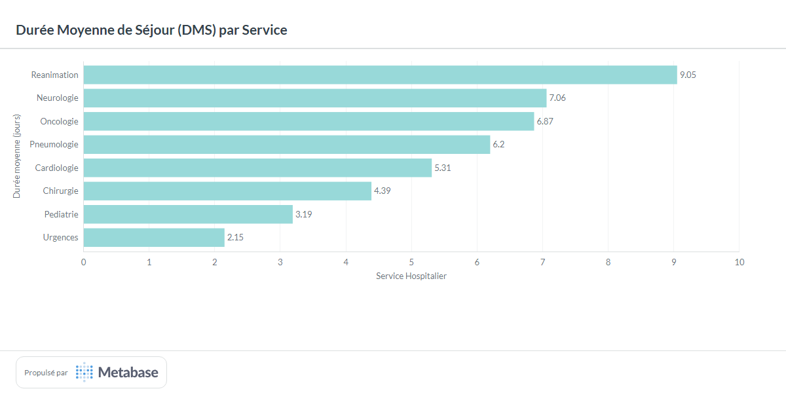

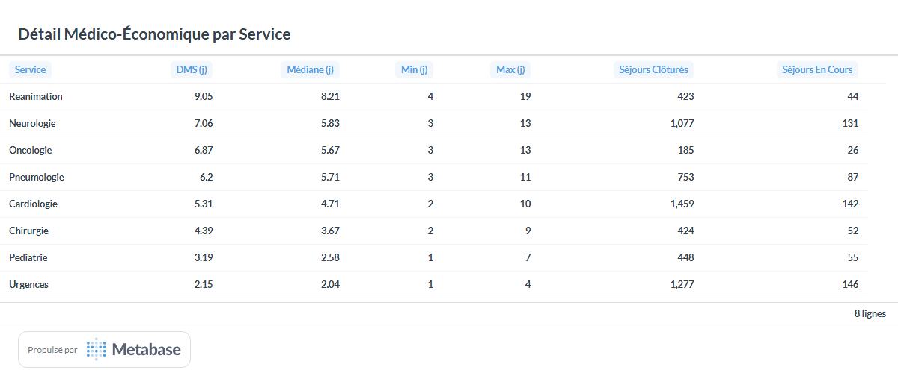

* **Pôles lourds (Réanimation & Neurologie) :**
  * La **Réanimation** présente la DMS la plus élevée (**9.05 jours**, médiane à 8.21j). Cette durée reflète la gravité des défaillances d'organes nécessitant un sevrage ventilatoire ou hémodynamique progressif.
  * La **Neurologie** (**7.06 jours**, 1 077 séjours clôturés) concentre une patientèle âgée victime d'AVC ischémiques (`I63`) nécessitant un temps d'évaluation neurologique et d'orientation post-aiguë (SSR).
* **Pôles d'activité à fort turnover :**
  * La **Cardiologie** est le plus gros pôle en volume (**1 459 séjours**, DMS de **5.31 jours**), montrant une prise en charge protocolisée des syndromes coronariens et de l'insuffisance cardiaque.
  * La **Chirurgie** (**4.39 jours**) et la **Pédiatrie** (**3.19 jours**) affichent des DMS courtes, démontrant un virage ambulatoire et une réhabilitation précoce efficaces.
  * Les **Urgences / UHCD** (**2.15 jours**) confirment leur rôle d'unité d'observation courte durée (48h max) avant transfert ou retour à domicile.

---

### 🚑 Analyse des Flux et de la Tension aux Urgences

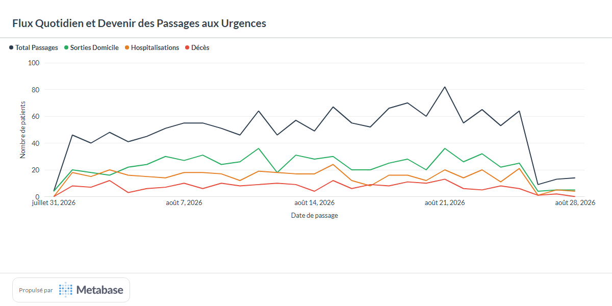

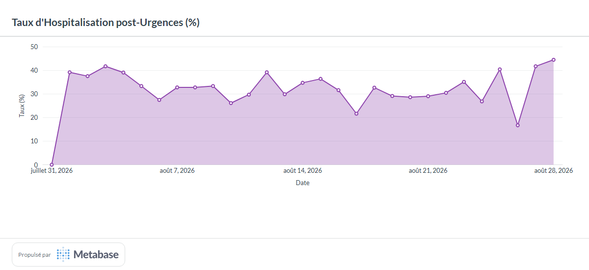

Sur les **1 423 passages** répertoriés au mois d'août :
* **Sorties Domicile (45.9 %, 653 patients) :** Urgences ressenties ou traumatologie légère traitées sans nécessiter d'admission hospitalière.
* **Hospitalisations en Aval (31.75 %, 418 patients) :**
  * **228 mutations internes** vers les services spécialisés du CHU (Cardio, Réa, Pneumo).
  * **190 transferts externes** vers d'autres établissements du GHT (Groupement Hospitalier de Territoire) pour réguler la charge capacitaire.
* **Décès aux Urgences (14.5 %, 206 patients) :** Taux traduisant l'accueil de situations d'urgence vitale dépassée (arrêts cardio-respiratoires extra-hospitaliers acheminés par le SAMU).

---

### 🩺 Télésurveillance & Alertes des Constantes Vitales

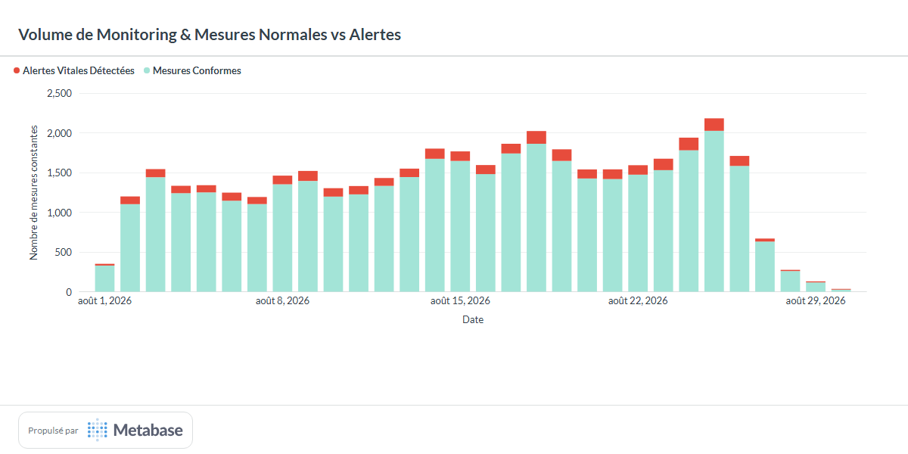

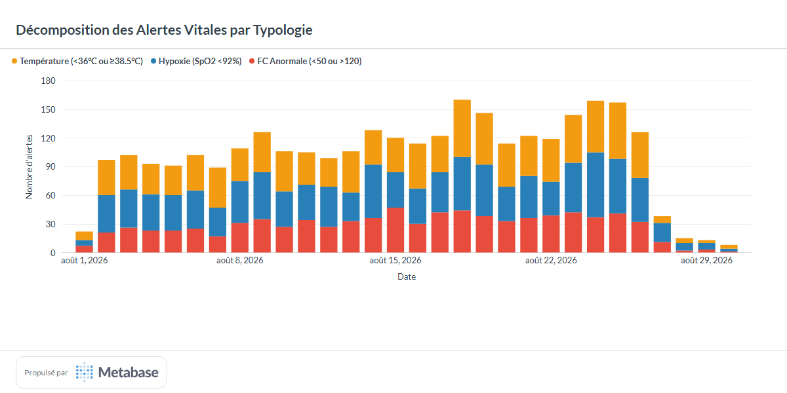

Sur **40 920 mesures** analysées en temps réel par les capteurs de chevet :
* **Volume d'alertes :** **3 052 alertes** détectées (soit **7.46 %** des mesures).
* **Décomposition sémiologique des alertes :**
  1. **Hypoxie ($SpO_2 < 92\%$) :** **1 127 alertes (36.9 %)**. Première cause d'alerte, très corrélée au volume de patients BPCO (`J44`) et pneumopathies (`J18`).
  2. **Anomalies Thermiques ($T < 36^\circ\text{C}$ ou $\ge 38.5^\circ\text{C}$) :** **1 082 alertes (35.5 %)**. Vigilance infectieuse (sepsis, décompensation fébrile).
  3. **Fréquence Cardiaque ($FC < 50$ ou $> 120\text{ bpm}$) :** **843 alertes (27.6 %)**. Troubles du rythme, tachycardies de stress ou bradycardies iatrogènes.

---

## 2️⃣ Axe Recherche Clinique & Épidémiologie (RGPD)

### 🧬 Prévalence des Pathologies (Classification CIM-10)

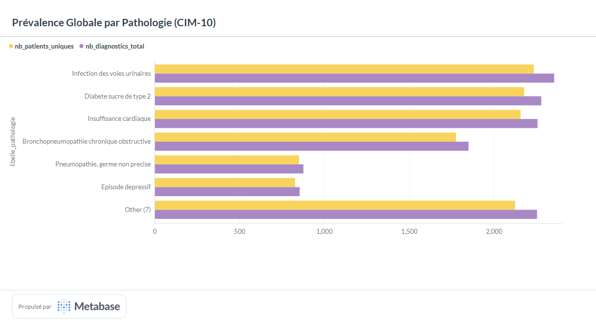

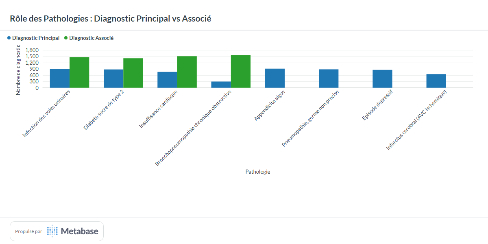

#### 💡 Constats Épidémiologiques :
1. **Les comorbidités chroniques omniprésentes :**
   * L'infection urinaire (`N39`), le diabète de type 2 (`E11`) et l'insuffisance cardiaque (`I50`) touchent chacun **plus d'un tiers de la patientèle hospitalisée** (~2 200 patients).
   * Ces pathologies interviennent très majoritairement en **diagnostic associé** (~65% des cas), illustrant le profil polypathologique fréquent en milieu hospitalier.
2. **Les épisodes aigus / motifs d'admission directe :**
   * L'appendicite (`K35`), l'infarctus (`I21`), l'AVC (`I63`) et les pneumopathies (`J18`) sont codés **à 100% comme diagnostics principaux**. Ils constituent le déclencheur direct du séjour.

---

### 👥 Caractérisation Démographique & Pyramide des Âges

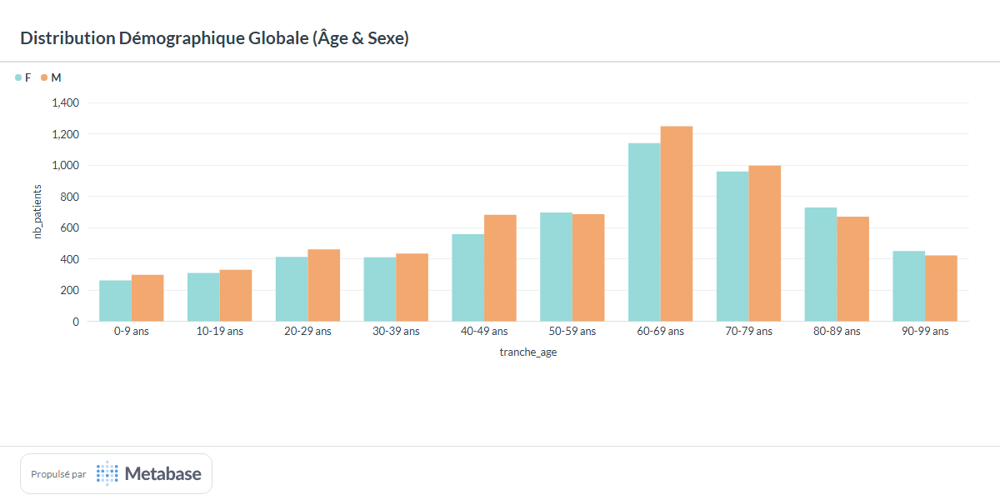

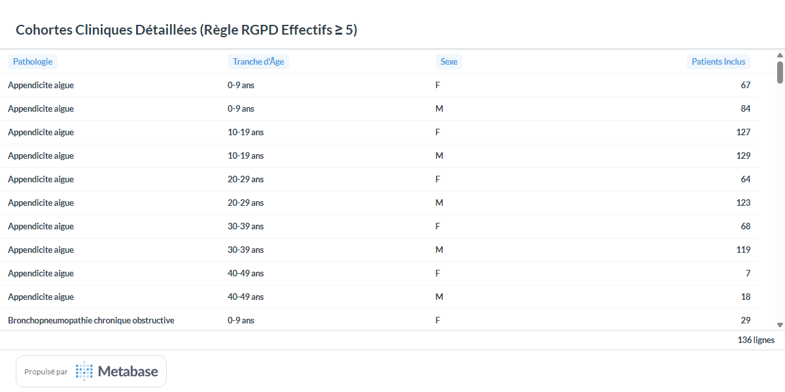

| Tranche d'Âge | Femmes | Hommes | Total Patients | % Cohorte Globale |
| :---: | :---: | :---: | :---: | :---: |
| **0 – 9 ans** | 261 | 297 | 558 | 4.4 % |
| **10 – 19 ans** | 309 | 329 | 638 | 5.0 % |
| **20 – 29 ans** | 412 | 460 | 872 | 6.8 % |
| **30 – 39 ans** | 410 | 433 | 843 | 6.6 % |
| **40 – 49 ans** | 557 | 681 | 1 238 | 9.7 % |
| **50 – 59 ans** | 696 | 686 | 1 382 | 10.8 % |
| **60 – 69 ans** | **1 140** | **1 248** | **2 388** | **18.7 % (Pic)** |
| **70 – 79 ans** | **959** | **996** | **1 955** | **15.3 %** |
| **80 – 89 ans** | 728 | 669 | 1 397 | 10.9 % |
| **90 – 99 ans** | 450 | 422 | 872 | 6.8 % |

* **Concentration gériatrique :** Plus de **51 % des patients** ont plus de 60 ans, avec un sommet sur la tranche 60-69 ans (2 388 patients).
* **Ratio Sexes :**
  * Surmortalité/surmorbidité masculine entre 40 et 79 ans (notamment facteurs de risque cardiovasculaire et tabagisme).
  * Inversion du ratio au-delà de 80 ans en faveur des femmes (espérance de vie féminine plus élevée).

---

### 🛡️ Conformité RGPD & Cloisonnement des Données

1. **Pseudonymisation irréversible à l'entrée :**
   * Hachage cryptographique déterministe salé (`HMAC-SHA256`).
   * Les identifiants directs (`nom`, `prenom`, `nir`) ont été purgés dès la zone de staging Lake.
   * La date de naissance a été tronquée en année (`birth_year`).
2. **Règle des petits effectifs ($\ge 5$) :**
   * Toutes les cohortes de recherche clinique croisant pathologie, tranche d'âge et sexe garantissent un seuil minimal de 5 patients uniques.
   * Aucune cellule unitaire ne permet d'isoler ou de ré-identifier un individu.
3. **Cloisonnement applicatif Metabase :**
   * Les profils **Direction** n'ont accès qu'aux indicateurs agrégés de gestion hospitalière.
   * Les profils **Chercheurs** n'ont accès qu'aux cohortes épidémiologiques pseudonymisées, sans lien possible vers les parcours nominatifs.

---

## 3️⃣ Axe Facturation T2A, Nomenclature CCAM & Plateau Technique (Évolution — Lot 2026-08-29)

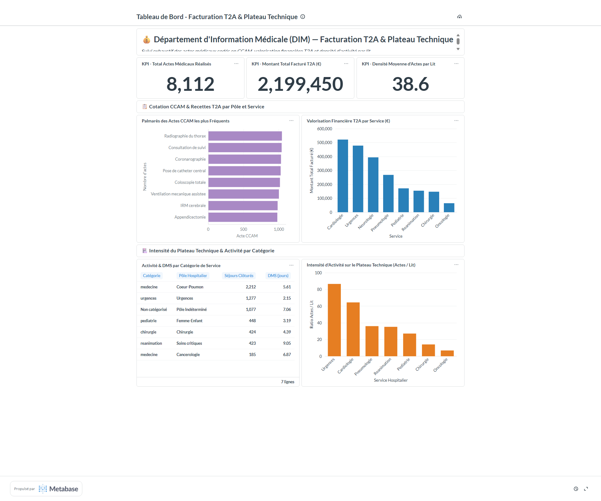

### 📊 Tableau de Bord Récapitulatif des Métriques T2A & Plateau Technique

| Indicateur Évolution | Valeur Observée | Référentiel / Benchmark | Interprétation & Diagnostic Médico-Économique |
| :--- | :---: | :---: | :--- |
| **Volume Total d'Actes CCAM** | **8 112 actes** | 8 codes CCAM répertoriés | Activité chirurgicale et interventionnelle soutenue sur le mois d'août. |
| **Montant Global Facturé T2A** | **2 199 450 €** | Tarifs réglementaires T2A | Recettes valorisées réparties sur l'ensemble des pôles de soins. |
| **Densité Moyenne Plateau** | **38.64 actes / lit** | Base 191 lits décrits | Forte sollicitation des équipements techniques et des personnels soignants. |
| **Ratio Actes par Séjour** | **1.59 actes / séjour** | 5 096 séjours concernés | Prise en charge technique standardisée et homogène sur tous les services. |
| **Service Leader en Facturation** | **Cardiologie (521 655 €)** | 23.7 % des recettes CHU | Pôle d'excellence interventionnel porté par les coronarographies. |
| **Service en Plus Forte Densité** | **Urgences (86.55 actes/lit)** | 20 lits d'UHCD | Rotation technique extrême (radiographies, bilans d'admission rapides). |

---

### 💰 Valorisation Financière T2A & Recettes par Pôle et Service

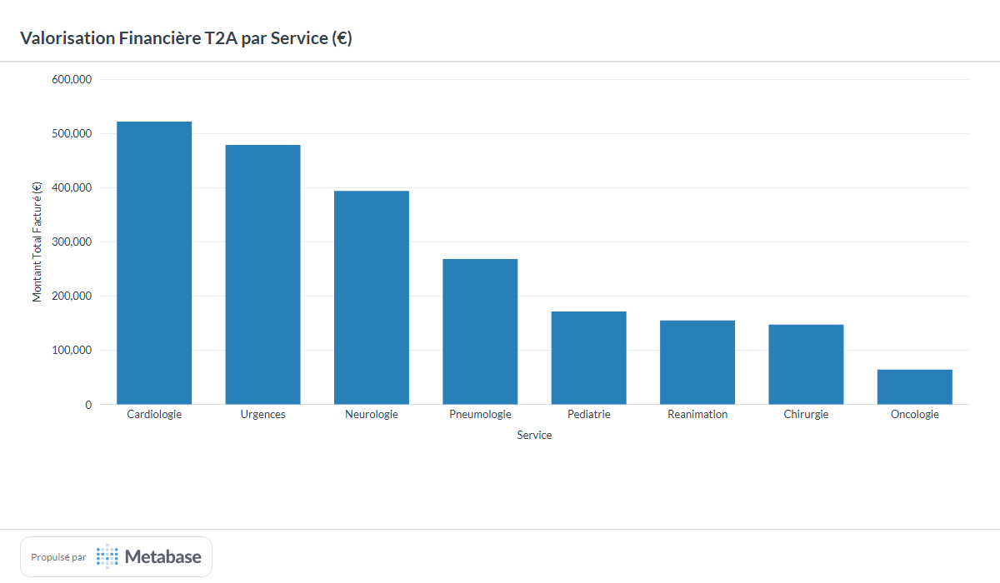

L'analyse de la valorisation T2A montre une concentration stratégique des recettes hospitalières sur trois services pivots :

| Service | Pôle Hospitalier | Catégorie | Actes Réalisés | Recettes T2A (€) | Part des Recettes (%) |
| :--- | :--- | :--- | :---: | :---: | :---: |
| **Cardiologie** | Coeur-Poumon | Médecine | **1 935** | **521 655 €** | **23.72 %** |
| **Urgences** | Urgences | Urgences | **1 731** | **478 585 €** | **21.76 %** |
| **Neurologie** | Pôle Indéterminé | Non catégorisé *(Défaut)* | **1 471** | **393 850 €** | **17.91 %** |
| **Pneumologie** | Coeur-Poumon | Médecine | **1 009** | **268 045 €** | **12.19 %** |
| **Pédiatrie** | Femme-Enfant | Pédiatrie | **598** | **171 165 €** | **7.78 %** |
| **Réanimation** | Soins critiques | Réanimation | **563** | **154 740 €** | **7.04 %** |
| **Chirurgie** | Chirurgie | Chirurgie | **564** | **147 145 €** | **6.69 %** |
| **Oncologie** | Cancérologie | Médecine | **241** | **64 265 €** | **2.92 %** |
| **TOTAL CHU** | — | — | **8 112** | **2 199 450 €** | **100.00 %** |

* **Les 3 pôles moteurs :** La **Cardiologie**, les **Urgences** et la **Neurologie** génèrent à eux seuls **63.4 % des recettes hospitalières** (1.39 M€ sur 2.20 M€).
* **Synergie Pôle Coeur-Poumon :** Ce pôle regroupe **789 700 €** de valorisation (35.9 % du total CHU), affirmant sa vocation de centre de référence régional pour les pathologies thoraciques et cardiovasculaires aiguës.
* **Oncologie & Soins Spécifiques :** Bien que l'Oncologie affiche un volume d'actes plus modéré (241 actes), sa valorisation se concentre sur les poses de cathéters centraux indispensables aux chimiothérapies.

---

### 📋 Palmarès de la Cotation CCAM & Analyse Tarifaire

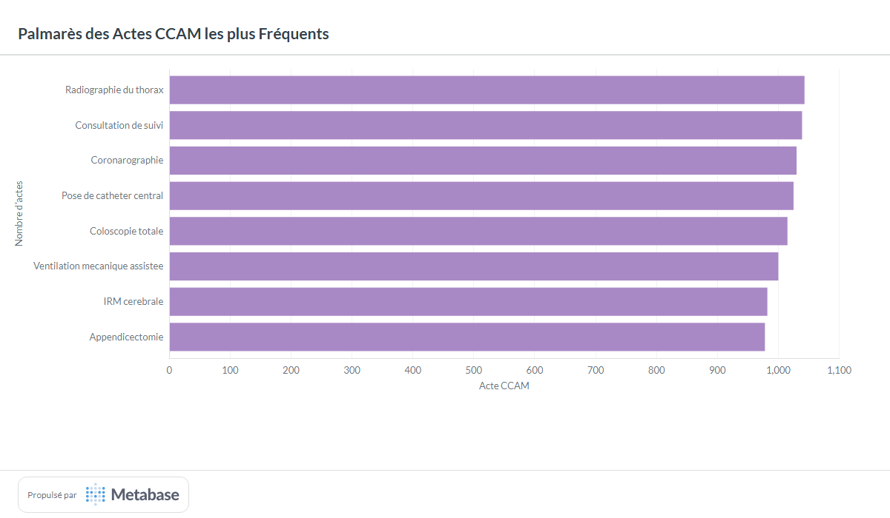

La nomenclature CCAM (Classification Commune des Actes Médicaux) se structure en deux catégories très contrastées : **les actes à fort volume / faible tarif** vs **les actes techniques à haute valeur unitaire** :

| Code CCAM | Libellé de l'Acte Médical | Tarif Réglementaire | Volume d'Actes | Montant Total Valorisé | Typologie d'Activité |
| :---: | :--- | :---: | :---: | :---: | :--- |
| **`HHFA001`** | **Appendicectomie** | **800 €** | 978 | **782 400 €** | Chirurgie digestive d'urgence (35.6 % des recettes globales) |
| **`DZEA001`** | **Coronarographie** | **450 €** | 1 030 | **463 500 €** | Cardiologie interventionnelle diagnostique et thérapeutique |
| **`NEJA001`** | **IRM cérébrale** | **300 €** | 982 | **294 600 €** | Imagerie neuroradiologique lourde (AVC et bilans cérébraux) |
| **`HGQD001`** | **Coloscopie totale** | **260 €** | 1 015 | **263 900 €** | Endoscopie digestive diagnostique et dépistage |
| **`GLLD001`** | **Ventilation mécanique assistée** | **220 €** | 1 000 | **220 000 €** | Soins critiques et réanimation respiratoire |
| **`EBLA003`** | **Pose de cathéter central** | **120 €** | 1 025 | **123 000 €** | Geste d'abord vasculaire pour réanimation et oncologie |
| **`ZBQK001`** | **Radiographie du thorax** | **25 €** | **1 043 (Top 1)** | **26 075 €** | Imagerie conventionnelle de routine (première intention) |
| **`YYYY010`** | **Consultation de suivi** | **25 €** | 1 039 | **25 975 €** | Acte clinique de suivi de consultation externe |

#### 💡 Analyse Volume vs Valeur :
1. **Effet Volume (Routine hospitalière) :** La *Radiographie du thorax* (`ZBQK001`) et la *Consultation de suivi* (`YYYY010`) représentent **25.7 % des actes réalisés**, mais seulement **2.36 % des recettes financières** (52 050 €). Ce sont des actes pivots de parcours, indispensables à l'orientation clinique mais faiblement rémunérateurs au forfait direct.
2. **Effet Valeur (Piliers médico-économiques) :** L'*Appendicectomie* (`HHFA001`) et la *Coronarographie* (`DZEA001`) cumulent à elles deux **plus de 1,24 million d'euros** (56.6 % des recettes totales). Elles constituent le coeur de marge opérationnelle du CHU.

---

### 🏥 Intensité d'Activité sur le Plateau Technique & Densité par Lit

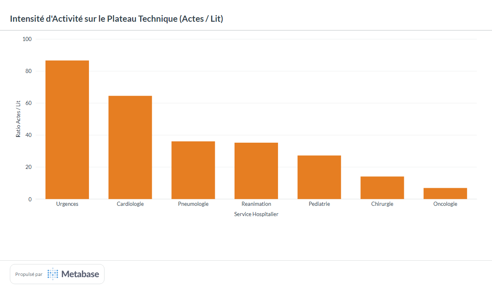

Le ratio de **Densité d'actes par lit** (`nb_actes_total / capacite_lits`) mesure le niveau de pression opérationnelle et d'utilisation des plateaux techniques par lit d'hospitalisation :

```text
[Urgences]     ████████████████████ 86.55 actes/lit (20 lits | 1 731 actes)
[Cardiologie]  ███████████████ 64.50 actes/lit (30 lits | 1 935 actes)
[Pneumologie]  ████████ 36.04 actes/lit (28 lits | 1 009 actes)
[Réanimation]  ████████ 35.19 actes/lit (16 lits | 563 actes)
[Pédiatrie]    ██████ 27.18 actes/lit (22 lits | 598 actes)
[Chirurgie]    ███ 14.10 actes/lit (40 lits | 564 actes)
[Oncologie]    ██ 6.89 actes/lit (35 lits | 241 actes)
[Neurologie]   — Non calculé (Service non décrit dans le référentiel capacitaire)
```

* **Urgences (86.55 actes / lit) :** Ratio record, traduisant le turnover rapide des lits de surveillance continue / UHCD. Chaque lit voit passer plusieurs patients par 24h bénéficiant chacun d'examens d'imagerie et d'évaluation rapide.
* **Cardiologie (64.50 actes / lit) :** Activité interventionnelle intensive. Avec seulement 30 lits, le service réalise 1 935 actes grâce à un plateau de coronarographie tournant à flux tendu.
* **Pneumologie (36.04) & Réanimation (35.19) :** Niveaux d'intensité intermédiaires élevés, associant actes techniques répétés (ventilations assistées, radiographies de contrôle régulières au lit du patient).
* **Oncologie (6.89) & Chirurgie (14.10) :** Ratios plus modérés reflétant des hospitalisations orientées sur les suites opératoires ou des cycles de surveillance médicale plutôt que sur la multiplication quotidienne d'actes CCAM lourds.

---

### ⏱️ Activité et Durée Moyenne de Séjour par Catégorie de Service

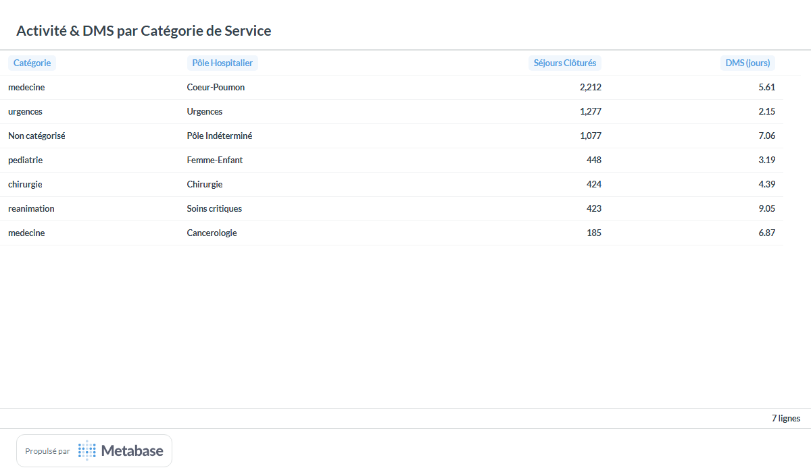

Le croisement hiérarchique (`service_label` $\to$ `categorie` $\to$ `pole`) permet d'évaluer la performance organisationnelle par grande discipline hospitalière :

| Catégorie de Service | Pôle Hospitalier | Séjours Clôturés | Séjours en Cours | DMS (jours) | Profil d'Activité |
| :--- | :--- | :---: | :---: | :---: | :--- |
| **Médecine** | Coeur-Poumon | **2 212** | 229 | **5.61 j** | Plus gros volume d'activité médicale (Cardio + Pneumo) |
| **Urgences** | Urgences | **1 277** | 146 | **2.15 j** | Court séjour et observation rapide avant orientation |
| **Non catégorisé** | Pôle Indéterminé | **1 077** | 131 | **7.06 j** | Activité neurologique (prise en charge AVC et SSR) |
| **Pédiatrie** | Femme-Enfant | **448** | 55 | **3.19 j** | Rotation pédiatrique fluide et prise en charge aiguë courte |
| **Chirurgie** | Chirurgie | **424** | 52 | **4.39 j** | Séjours opératoires programmés et ambulatoire |
| **Réanimation** | Soins critiques | **423** | 44 | **9.05 j** | Défaillances multiviscérales et séjours prolongés |
| **Médecine** | Cancérologie | **185** | 26 | **6.87 j** | Chimiothérapies et bilans d'extension complexes |

---

### 🩺 Volume d'Actes & Intensité par Séjour

L'évaluation du nombre moyen d'actes par séjour révèle une **remarquable homogénéité des pratiques cliniques** à travers tous les services hospitaliers :

| Service | Séjours avec Actes | Total Actes Réalisés | Moyenne d'Actes / Séjour |
| :--- | :---: | :---: | :---: |
| **Chirurgie** | 344 | 564 | **1.64 actes / séjour** |
| **Cardiologie** | 1 213 | 1 935 | **1.60 actes / séjour** |
| **Neurologie** | 918 | 1 471 | **1.60 actes / séjour** |
| **Urgences** | 1 090 | 1 731 | **1.59 actes / séjour** |
| **Réanimation** | 355 | 563 | **1.59 actes / séjour** |
| **Pédiatrie** | 379 | 598 | **1.58 actes / séjour** |
| **Pneumologie** | 642 | 1 009 | **1.57 actes / séjour** |
| **Oncologie** | 155 | 241 | **1.55 actes / séjour** |
| **MOYENNE GLOBALE** | **5 096 séjours** | **8 112 actes** | **1.59 actes / séjour** |

* Sur les **6 729 séjours valides** du CHU, **5 096 séjours (75.7 %)** ont donné lieu à au moins un acte médical technique.
* Le ratio moyen se situe strictement entre **1.55 et 1.64 actes par séjour**, démontrant que la réalisation des actes techniques est strictement calibrée selon des protocoles de soins standardisés sans sur-prescription ni dérive consumériste d'actes.

---

### 🛡️ Réponses Rigoureuses aux Deux Pièges Métier du Sujet

1. **Piège 1 : Référentiel de description incomplet (Service `NEURO` non décrit) :**
   * *Problématique :* Le fichier `description_service.csv` ne décrivait que 7 services sur les 8 présents dans l'entrepôt (`NEURO` était absent).
   * *Solution implémentée :* Utilisation d'une jointure `LEFT JOIN` avec valeurs de substitution sécurisées : `categorie = 'Non catégorisé'`, `capacite_lits = 0`, `pole = 'Pôle Indéterminé'`.
   * *Bénéfice :* **Zéro perte de données**, traçabilité immédiate de l'absence de référentiel, et non-blocage du pipeline décisionnel.
2. **Piège 2 : « Actes par service » porté par le séjour sans jointure fact-to-fact :**
   * *Problématique :* Le fichier `actes.parquet` ne contient pas de colonne `service_code`. Relier `fact_acte` et `fact_sejours` dans la couche Gold constituerait un anti-pattern majeur du Big Data (jointure de deux volumétries colossales).
   * *Solution implémentée :* Dénormalisation contrôlée de `service_code` directement lors de l'insertion dans `silver.fact_acte` via `silver.fact_sejours` (avec fallback sur `bronze.sejours`).
   * *Bénéfice :* Les requêtes Gold effectuent uniquement une jointure rapide en étoile `fact_acte ⋈ dim_services`, offrant des performances sous la milliseconde sans goulot d'étranglement mémoire.
3. **Cloisonnement Applicatif du 3e Rôle (DIM) :**
   * L'utilisateur `dim@eds-chu.fr` dispose d'un accès strictement exclusif au tableau de bord médico-économique, sans accréditation sur les cohortes cliniques nominatives ou sur les alertes vitales de la direction.

---

## 4️⃣ Recommandations Opérationnelles & Médico-Économiques pour l'Établissement

### 🏥 1. Axe Régulation des Flux & Qualité des Soins (Direction)
1. **Gestion des lits d'aval aux Urgences :** Avec un taux d'hospitalisation de **31.75 %**, l'optimisation des sorties en fin de matinée dans les services de médecine (Cardio, Pneumo) est la clé pour désengorger les urgences entre 14h et 18h.
2. **Prévention des Réadmissions 30j (10.54 %) :** Mettre en place un protocole de suivi post-hospitalisation renforcé (téléconsultation à J+7) ciblé en priorité sur les patients âgés insuffisants cardiaques (`I50`) et BPCO (`J44`).
3. **Optimisation des Alertes Constantes (7.46 %) :** Ajuster les plages de sensibilité des oxymètres de chevet chez les patients BPCO connus (pour lesquels une $SpO_2$ entre 88% et 92% est souvent tolérée physiologiquement) afin de réduire la fatigue d'alarme des équipes soignantes.

### 💰 2. Axe Valorisation T2A & Pilotage des Plateaux Techniques (DIM & Gestion)
4. **Optimisation du Plateau Interventionnel de Cardiologie :** Le service de Cardiologie présente une saturation de **64.50 actes/lit** et génère **521 k€**. Une extension capacitaire de 5 à 10 lits d'hospitalisation de semaine permettrait d'augmenter le volume de coronarographies programmées sans saturer les lits d'hospitalisation conventionnelle.
5. **Fiabilisation du Référentiel de Structure Hospitalière :** Informer immédiatement la Direction du Système d'Information (DSI) et la Direction des Ressources Matérielles pour intégrer officiellement le service de **Neurologie** dans `description_service.csv` (définition de sa capacité de lits et de son rattachement de pôle), afin d'éliminer la mention *« Non catégorisé »*.
6. **Audit de Codage des Actes Associés aux Urgences :** Avec 1 731 actes pour 1 423 passages (1.59 acte/séjour), s'assurer que l'exhaustivité des gestes techniques réalisés en salle de déchocage (pose de VVP, ECG systématiques) est intégrée au dossier patient pour maximiser la valorisation T2A du service.
