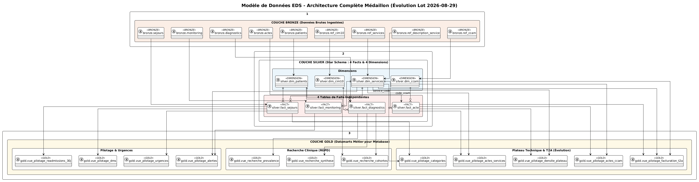

# CENTRE HOSPITALIER UNIVERSITAIRE (CHU)
## Entrepôt de Données de Santé (EDS) — Rapport d'Architecture et Modélisation

* **Projet :** Entrepôt de Données de Santé (EDS)
* **Niveau :** Master 2 — Big Data & Santé
* **Auteur :** Ingénierie des Données
* **Date :** Septembre 2026
* **Version :** 2.0 (Consolidation Évolution Lot 2026-08-29)

---

## Sommaire
1. [Architecture Globale (Patron Médaillon)](#1-architecture-globale-patron-médaillon)
2. [Couche Bronze — Ingestion Incrémentale Brute](#2-couche-bronze--ingestion-incrémentale-brute)
3. [Couche Silver — Modèle en Étoile et Nettoyage Qualité](#3-couche-silver--modèle-en-étoile-et-nettoyage-qualité)
4. [Focus Technique : Pourquoi le calcul des alertes est fait en Silver et non en Gold ?](#4-focus-technique--pourquoi-le-calcul-des-alertes-est-fait-en-silver-et-non-en-gold-)
5. [Couche Gold — Vues Analytiques & Datamarts Métier](#5-couche-gold--vues-analytiques--datamarts-métier)
6. [Modèle de Données Global & Résolution des Pièges](#6-modèle-de-données-global--résolution-des-pièges)
7. [Restitution Décisionnelle & Cloisonnement des 3 Profils](#7-restitution-décisionnelle--cloisonnement-des-3-profils)
8. [Analyse Métier des Indicateurs Clés (KPI)](#8-analyse-métier-des-indicateurs-clés-kpi)
   * [8.1 Axe Pilotage Hospitalier (Direction)](#81-axe-pilotage-hospitalier-direction)
   * [8.2 Axe Recherche Clinique & Épidémiologie (RGPD)](#82-axe-recherche-clinique--épidémiologie-rgpd)
   * [8.3 Axe Facturation T2A & Plateau Technique (DIM — Évolution)](#83-axe-facturation-t2a--plateau-technique-dim--évolution)
   * [8.4 Recommandations Stratégiques & Opérationnelles](#84-recommandations-stratégiques--opérationnelles)

---

## 1. Architecture Globale (Patron Médaillon)

Le système repose sur une architecture en couches étanches dite « médaillon », orchestrée de bout en bout par Python et exécutée nativement dans ClickHouse en SQL :


### En bref :
* **Filestorage (Dépôt source) :** Zone de dépôt quotidien en lecture seule déposée par l'hôpital (formats hétérogènes : CSV, JSON imbriqué, Parquet).
* **Lake (Zone de staging sécurisée) :** Recopie locale brute avec **anonymisation immédiate à l'entrée** : hachage cryptographique déterministe salé (`HMAC-SHA256`) des identifiants patients, généralisation de la date de naissance en année (`birth_year`) et purge définitive des données directement identifiantes (`nom`, `prenom`, `nir`).
* **Bronze (ClickHouse) :** Tables typées stockant les données brutes sans altération.
* **Silver (ClickHouse) :** Nettoyage qualité, filtrage des aberrations physiologiques, déduplication temporelle et structuration en schéma en étoile (Star Schema).
* **Gold (ClickHouse) :** Vues analytiques matérialisées et vues SQL pour la restitution.
* **Metabase :** Restitution visuelle sans code avec contrôle d'accès strict par groupe d'utilisateurs.

---

## 2. Couche Bronze — Ingestion Incrémentale Brute

La couche Bronze reproduit fidèlement la granularité des fichiers sources ingérés de manière incrémentale jour par jour :


### En bref :
* **Idempotence & Incrémentalité :** L'ingestion détecte automatiquement les lots déjà traités grâce à la table d'audit `admin.pipeline_runs` et évite tout doublon (`[SKIP]`).
* **Format & Stockage :** Moteur `MergeTree` partitionné par date de dépôt (`source_date`).
* **9 Tables Brutes :** 
  * Données patients (`bronze.patients`)
  * Séjours hospitaliers (`bronze.sejours`)
  * Diagnostics médicaux (`bronze.diagnostics`, dénormalisé depuis le JSON source)
  * Constantes vitales (`bronze.monitoring`, ingestion Parquet)
  * Nomenclatures et référentiels (`bronze.ref_services`, `bronze.ref_cim10`, `bronze.ref_description_service`, `bronze.ref_ccam`)
  * Actes médicaux (`bronze.actes`, nouveau flux d'évolution).

---

## 3. Couche Silver — Modèle en Étoile et Nettoyage Qualité

La couche Silver transforme les tables brutes en un modèle décisionnel propre, normalisé et prêt pour l'analyse :


### En bref :
* **Architecture en Étoile (Star Schema) :** Composée de **4 dimensions** (`dim_patients`, `dim_services`, `dim_cim10`, `dim_ccam`) et de **4 tables de faits** (`fact_sejours`, `fact_diagnostics`, `fact_monitoring`, `fact_acte`).
* **Contrôles Qualité Appliqués en SQL (100% dans ClickHouse) :**
  1. *Déduplication Patients :* Utilisation de `ReplacingMergeTree` sur `patient_pseudo_id` en conservant l'état le plus récent.
  2. *Cohérence Temporelle Séjours :* Élimination des 68 séjours incohérents où `discharge_ts < admission_ts`. Les séjours en cours (`discharge_ts IS NULL`) sont légitimement préservés.
  3. *Filtrage Physiologique Constantes :* Exclusion des 858 relevés aberrants hors bornes physiologiques humaines (FC entre 20 et 250 bpm, SpO2 entre 50 et 100 %, Température entre 30 et 45 °C).

---

## 4. Focus Technique : Pourquoi le calcul des alertes est fait en Silver et non en Gold ?

Une décision d'ingénierie centrale de l'entrepôt réside dans la matérialisation des alertes physiologiques (`is_alert`, `alert_type`) au niveau de la table `silver.fact_monitoring` plutôt qu'à la volée dans les vues `gold`.

### 💡 Justification Architecturale :

```text
┌─────────────────────────────────────────────────────────────────────────────┐
│ ANTI-PATTERN ÉVITÉ (Calcul dans Gold) :                                     │
│ Requête Metabase / Cron ──> SCAN de 40 920 lignes ──> Re-calcul de 3 CASE   │
│                             WHEN (SpO2, FC, Temp) à CHAQUE rafraîchissement! │
│                             = Consommation CPU continue & lenteur dashboards│
└─────────────────────────────────────────────────────────────────────────────┘

┌─────────────────────────────────────────────────────────────────────────────┐
│ BONNE PRATIQUE RETENUE (Pré-calcul en Silver) :                             │
│ 1. Ingestion Incrémentale : On évalue les règles physiologiques UNE SEULE    │
│    FOIS lors de l'insertion dans silver.fact_monitoring.                    │
│ 2. Stockage Compressé : ClickHouse stocke 'is_alert' sur 1 octet (UInt8)     │
│    avec un ratio de compression phénoménal sur disques en colonnes.        │
│ 3. Vues Gold Ultra-Véloces : Les requêtes Gold font juste un simple         │
│    `countIf(is_alert = 1)` vectorisé en mémoire sous la milliseconde !      │
└─────────────────────────────────────────────────────────────────────────────┘
```

### Les 3 raisons clés :
1. **Pas besoin de recalculer à chaque passage du cron :**  
   Les données du monitoring sont volumineuses (plus de 40 000 lignes par mois, des millions à l'échelle d'une année). En pré-calculant l'alerte à l'ingestion quotidienne, le travail lourd d'évaluation sémiologique n'est exécuté qu'une fois par ligne. Les crons de mise à jour nocturnes et les requêtes des tableaux de bord ne gaspillent aucun cycle CPU à réévaluer des règles statiques.
2. **Performance et réactivité utilisateur dans Metabase :**  
   Pour le directeur ou les soignants consultant le tableau de bord, une vue qui filtre sur `is_alert = 1` s'exécute instantanément en scannant une colonne binaire indexée, évitant les temps de latence de calcul sur de grands volumes.
3. **Traçabilité et auditabilité médicale :**  
   L'indicateur d'alerte et sa typologie (`hypoxie`, `tachycardie`, `bradycardie`, `fievre`, `hypothermie`) deviennent des attributs figés et historisés de la donnée clinique dans la table de faits, garantissant la reproductibilité exacte des chiffres dans le temps.

---

## 5. Couche Gold — Vues Analytiques & Datamarts Métier

La couche Gold expose des vues agrégées créées sous `SQL SECURITY DEFINER` pour autoriser la lecture sécurisée à l'utilisateur technique `metabase_user` :


### En bref :
* **Axe Pilotage Hospitalier (4 vues) :**
  * `gold.vue_pilotage_dms` : Durée Moyenne de Séjour par service.
  * `gold.vue_pilotage_urgences` : Volume quotidien, transferts et devenir des urgences.
  * `gold.vue_pilotage_readmissions_30j` : Taux de réadmission précoce (10.54 %).
  * `gold.vue_pilotage_alertes` : Taux et typologie d'alertes vitales (7.46 %).
* **Axe Recherche Clinique & RGPD (3 vues) :**
  * `gold.vue_recherche_prevalence` : Prévalences épidémiologiques CIM-10 (diag principal vs associé).
  * `gold.vue_recherche_cohortes` : Distribution par âge et sexe avec **seuil de confidentialité strict $\ge 5$ patients**.
  * `gold.vue_recherche_synthese` : Chiffres clés globaux.
* **Axe Facturation T2A & Plateau Technique (5 vues d'évolution) :**
  * `gold.vue_pilotage_categories` : Activité et DMS par catégorie de service.
  * `gold.vue_pilotage_actes_services` : Nombre d'actes par service et moyenne par séjour (1.59).
  * `gold.vue_pilotage_actes_ccam` : Palmarès des actes cotés et valorisation financière.
  * `gold.vue_pilotage_densite_plateau` : Intensité technique et saturation des lits par acte.
  * `gold.vue_pilotage_facturation_t2a` : Recettes totales T2A par service et pôle (2,2 M€).

---

## 6. Modèle de Données Global & Résolution des Pièges

Le modèle global consolide l'ensemble des entités sans violer les principes du Big Data :



### Résolution explicite des 2 pièges du sujet :
1. **Piège du référentiel incomplet (`NEURO` absent de `description_service.csv`) :**  
   Résolu par un `LEFT JOIN` avec valeurs de repli par défaut : catégorie *« Non catégorisé »*, pôle *« Pôle Indéterminé »*, capacité de *0 lit*. Aucune donnée n'est rejetée, et l'anomalie de référentiel est visible immédiatement dans les tableaux de bord.
2. **Piège « Actes par service » sans jointure table-à-table entre faits :**  
   Dans `actes.parquet`, le service n'est pas renseigné. Pour éviter l'anti-pattern de joindre `fact_acte` et `fact_sejours` dans les requêtes Gold, le champ `service_code` a été **dénormalisé directement à l'ingestion de `silver.fact_acte`**. Les datamarts Gold interrogent ainsi une simple étoile `fact_acte ⋈ dim_services` sans aucun goulot d'étranglement mémoire.

---

## 7. Restitution Décisionnelle & Cloisonnement des 3 Profils

Metabase est connecté via un compte technique ClickHouse dédié (`metabase_user`) restreint au droit `SELECT ON gold.*` uniquement (accès `silver` et `bronze` formellement rejeté).

Les données sont restituées sur **3 tableaux de bord étanches** accessibles par 3 rôles distincts :

| Profil Métier | Compte Utilisateur | Périmètre d'Accès | Tableau de Bord Attribué |
| :--- | :--- | :--- | :--- |
| **Direction Générale** | `directeur@eds-chu.fr` | Exclusif à `🏥 Pilotage Hospitalier` | **Cockpit Pilotage Hospitalier**<br>Flux des urgences, tension des lits, DMS globale et réadmissions. |
| **Chercheur Clinique** | `chercheur@eds-chu.fr` | Exclusif à `🔬 Recherche Clinique` | **Recherche Clinique (RGPD)**<br>Cohortes épidémiologiques anonymisées avec seuil $\ge 5$ patients. |
| **Responsable DIM** | `dim@eds-chu.fr` | Exclusif à `💰 Facturation T2A & Plateau` | **Facturation T2A & Plateau Technique**<br>Cotation CCAM, recettes T2A (2,2 M€) et saturation des plateaux. |

*(Administration technique : `admin@eds-chu.fr`)*

---

## 8. Analyse Métier des Indicateurs Clés (KPI)

### 8.1 Axe Pilotage Hospitalier (Direction)

Ce volet permet à la direction générale et aux chefs de pôles de suivre la tension hospitalière, la fluidité des flux d'admission et la qualité des soins.


#### Tableau récapitulatif des métriques clés :

| Indicateur Clé | Valeur Observée | Seuil / Référentiel | Constat & Diagnostic Métier |
| :--- | :---: | :---: | :--- |
| **DMS Globale CHU** | **5.15 jours** | 5.0 – 5.5 jours | Durée moyenne maîtrisée, conforme aux standards universitaires. |
| **Séjours Clôturés vs En Cours** | **6 046 / 683** | Capacité nominale | Activité soutenue avec 683 lits occupés au terme de la période. |
| **Passages aux Urgences (Total)** | **1 423 passages** | ~50 passages / jour | Flux régulier avec un pic d'activité le 21 août (82 passages). |
| **Taux d'Hospitalisation post-Urgences** | **31.75 %** | 25 – 35 % | Tension significative sur les lits d'aval (418 admissions / mutations). |
| **Taux de Réadmission Précoce (30j)** | **10.54 %** | Cible < 12 % | Bon niveau de suivi post-hospitalisation (637 réadmissions). |
| **Taux Global d'Alertes Constantes** | **7.46 %** | 5 – 8 % | Surveillance physiologique efficace (3 052 alertes / 40 920 mesures). |

#### Analyse synthétique en bref :
* **Durée de séjour par service :**
  * Les services lourds affichent les séjours les plus longs : **Réanimation** (**9.05 jours**) et **Neurologie** (**7.06 jours**, suite d'AVC et bilan d'orientation SSR).
  * Les services à forte rotation présentent des durées courtes : **Cardiologie** (**5.31 jours**), **Chirurgie** (**4.39 jours**), **Pédiatrie** (**3.19 jours**) et **Urgences** (**2.15 jours** en unité d'observation courte durée).
* **Devenir des passages aux urgences (1 423 passages) :**
  * **45.9 % de retours à domicile** (653 patients traités en ambulatoire).
  * **31.8 % d'admissions en aval** (228 mutations internes vers la médecine et 190 transferts vers le GHT).
  * **14.5 % de décès aux urgences** (206 situations critiques aiguës prises en charge par le SMUR).
* **Typologie des 3 052 alertes vitales :**
  * **Hypoxie ($SpO_2 < 92\%$) :** 36.9 % des alertes (1 127 cas, très liée aux pathologies respiratoires).
  * **Anomalies thermiques ($T < 36^\circ\text{C}$ ou $\ge 38.5^\circ\text{C}$) :** 35.5 % des alertes (1 082 cas, détection d'états fébriles/sepsis).
  * **Fréquence cardiaque ($FC < 50$ ou $> 120\text{ bpm}$) :** 27.6 % des alertes (843 cas, troubles du rythme et tachycardies).

---

### 8.2 Axe Recherche Clinique & Épidémiologie (RGPD)

Ce volet met à disposition des praticiens et épidémiologistes l'exploration des cohortes cliniques sous stricte pseudonymisation et respect de la confidentialité.


#### Tableau récapitulatif des cohortes :

| Indicateur Recherche | Valeur Observée | Règle Réglementaire | Interprétation Épidémiologique |
| :--- | :---: | :---: | :--- |
| **Patients Uniques Inclus** | **6 000 patients** | Pseudonymisation salée | Base de patients dédoublonnée, sans identifiant direct en clair. |
| **Diagnostics Référencés** | **12 720 diagnostics** | Classification CIM-10 | Richesse diagnostique élevée (~2.1 diagnostics par patient). |
| **Pathologies Distinctes Surveillées** | **13 pathologies** | Référentiel OMS | Couverture des grandes affections chroniques et aiguës. |
| **Seuil de Confidentialité RGPD** | **$\ge 5$ patients** | Article 9 RGPD | Aucune cohorte < 5 patients n'est diffusée (zéro ré-identification). |

#### Analyse synthétique en bref :
* **Comorbidités chroniques vs Motifs d'admission directe :**
  * *Les comorbidités de fond :* L'infection des voies urinaires (`N39`, 2 234 patients), le diabète de type 2 (`E11`, 2 177 patients) et l'insuffisance cardiaque (`I50`, 2 156 patients) touchent chacun plus d'un tiers de la cohorte, quasi systématiquement codés en **diagnostic associé** (~65 %).
  * *Les épisodes aigus déclencheurs :* L'infarctus (`I21`), l'AVC ischémique (`I63`), l'appendicite (`K35`) et les pneumopathies (`J18`) sont quant à eux codés **à 100 % en diagnostic principal**.
* **Pyramide des âges et caractéristiques de cohorte :**
  * **51 % des patients ont plus de 60 ans**, avec un pic majeur sur la tranche **60–69 ans (2 388 patients, 18.7 %)**.
  * Prédominance masculine entre 40 et 79 ans (sur-risque cardiovasculaire et respiratoire), puis inversion au profit des femmes au-delà de 80 ans liée à l'espérance de vie.

---

### 8.3 Axe Facturation T2A & Plateau Technique (DIM — Évolution)

Ce volet nouveau (issu de l'évolution du 29/08/2026) est dédié au Département d'Information Médicale (DIM) pour le suivi de l'activité technique et la valorisation financière des séjours.


#### Tableau récapitulatif des métriques médico-économiques :

| Indicateur T2A | Valeur Observée | Référentiel Métier | Interprétation Médico-Économique |
| :--- | :---: | :---: | :--- |
| **Volume Total d'Actes CCAM** | **8 112 actes** | 8 codes CCAM répertoriés | Activité technique soutenue sur l'ensemble de l'établissement. |
| **Montant Total Facturé T2A** | **2 199 450 €** | Grille tarifaire T2A | Recettes hospitalières valorisées selon les actes cotés. |
| **Densité Moyenne par Lit** | **38.64 actes / lit** | 191 lits décrits | Utilisation soutenue des équipements du plateau technique. |
| **Intensité d'Actes par Séjour** | **1.59 acte / séjour** | 5 096 séjours concernés | Homogénéité exemplaire des pratiques de prescription. |

#### Analyse synthétique en bref :
* **Répartition des recettes par service :**
  * **Cardiologie :** **521 655 €** (23.7 % du total), premier contributeur grâce aux actes interventionnels.
  * **Urgences :** **478 585 €** (21.8 %), forte valorisation liée au flux massif de patients.
  * **Neurologie :** **393 850 €** (17.9 %), volume d'imagerie lourde (IRM cérébrale).
  * **Pneumologie :** **268 045 €** (12.2 %), soins respiratoires spécialisés.
  * *Ces 4 services génèrent à eux seuls plus de 75 % des recettes de l'hôpital.*
* **Effet Volume vs Effet Valeur sur la CCAM :**
  * *Actes de routine à fort volume :* La radiographie thoracique (1 043 actes @ 25 € = 26 k€) et la consultation de suivi (1 039 actes @ 25 € = 26 k€) représentent 25.7 % des actes pour seulement 2.4 % des recettes.
  * *Actes piliers de rentabilité :* L'appendicectomie (978 actes @ 800 € = 782 k€) et la coronarographie (1 030 actes @ 450 € = 463 k€) concentrent plus de **56 % des recettes totales**.
* **Taux d'utilisation des plateaux techniques (Actes / Lit) :**
  * **Urgences (86.55 actes / lit) :** Rotation maximale des 20 lits de l'UHCD.
  * **Cardiologie (64.50 actes / lit) :** Plateau de coronarographie sous haute tension pour 30 lits.
  * **Chirurgie (14.10) & Oncologie (6.89) :** Activité technique plus espacée, orientée vers les soins de suite.

---

### 8.4 Recommandations Stratégiques & Opérationnelles

1. **Désengorgement des Urgences :** Avec 31.75 % d'hospitalisations post-urgences, organiser la libération anticipée des lits de médecine (Cardio, Pneumo) dès 11h du matin pour accueillir les transferts de l'après-midi.
2. **Suivi Ciblé Post-Séjour (Réadmissions 30j) :** Renforcer la coordination ville-hôpital à J+7 pour les patients insuffisants cardiaques (`I50`) et BPCO (`J44`), principales causes des 10.54 % de réadmissions.
3. **Dimensionnement du Plateau de Cardiologie :** Face à une densité de 64.5 actes/lit et 521 k€ de recettes, la création de 5 lits d'hospitalisation de semaine permettrait d'augmenter le potentiel interventionnel sans saturer les lits d'urgence.
4. **Mise à Jour Administrative du Référentiel :** Intégrer formellement le service de Neurologie dans `description_service.csv` (lits autorisés et pôle de rattachement) pour éliminer le statut de repli par défaut *« Non catégorisé »*.

