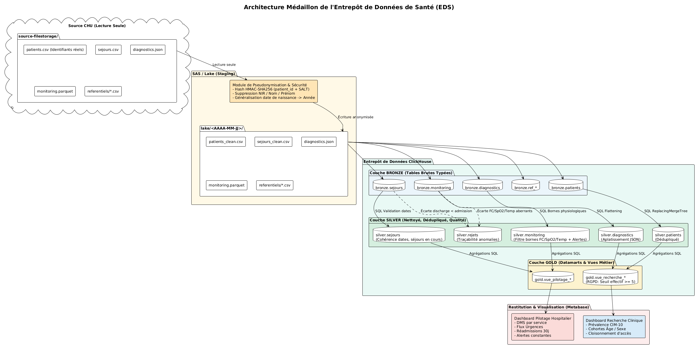
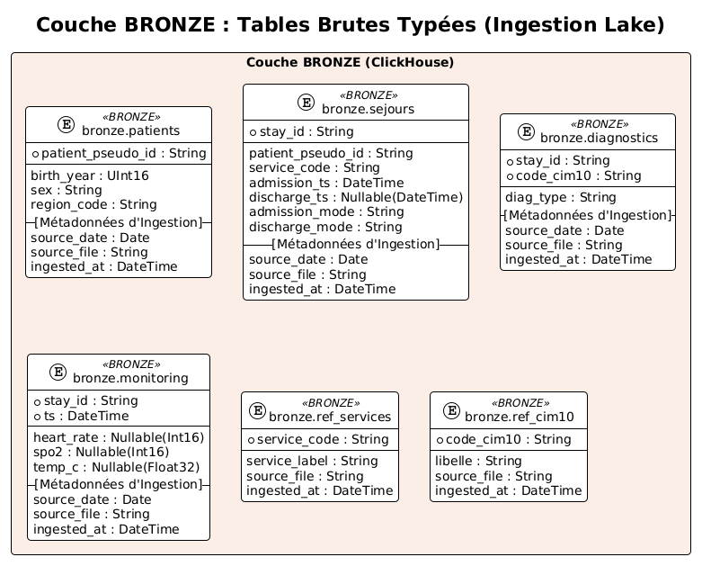
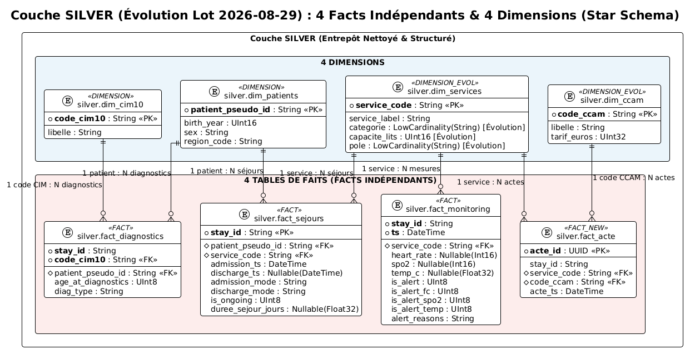
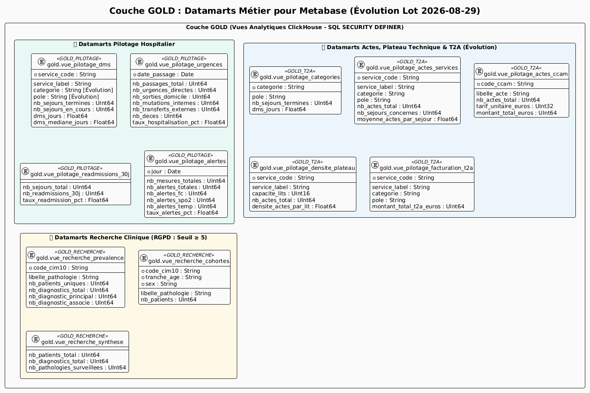
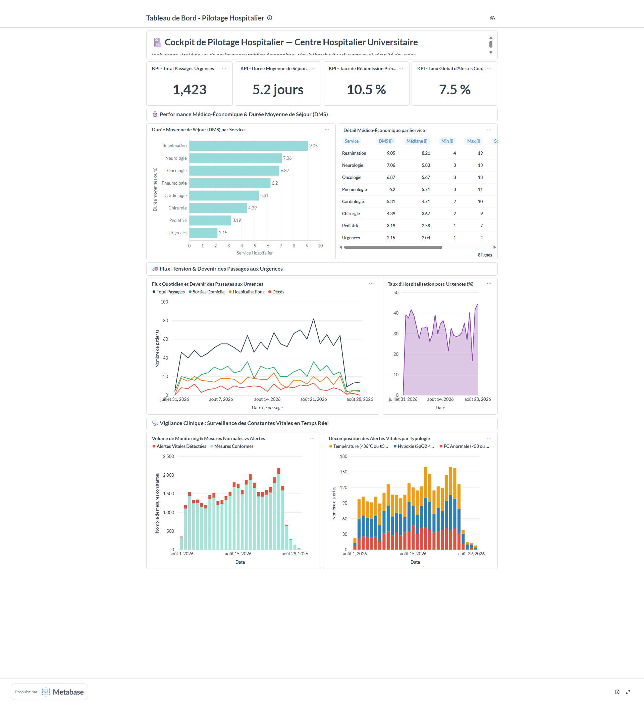
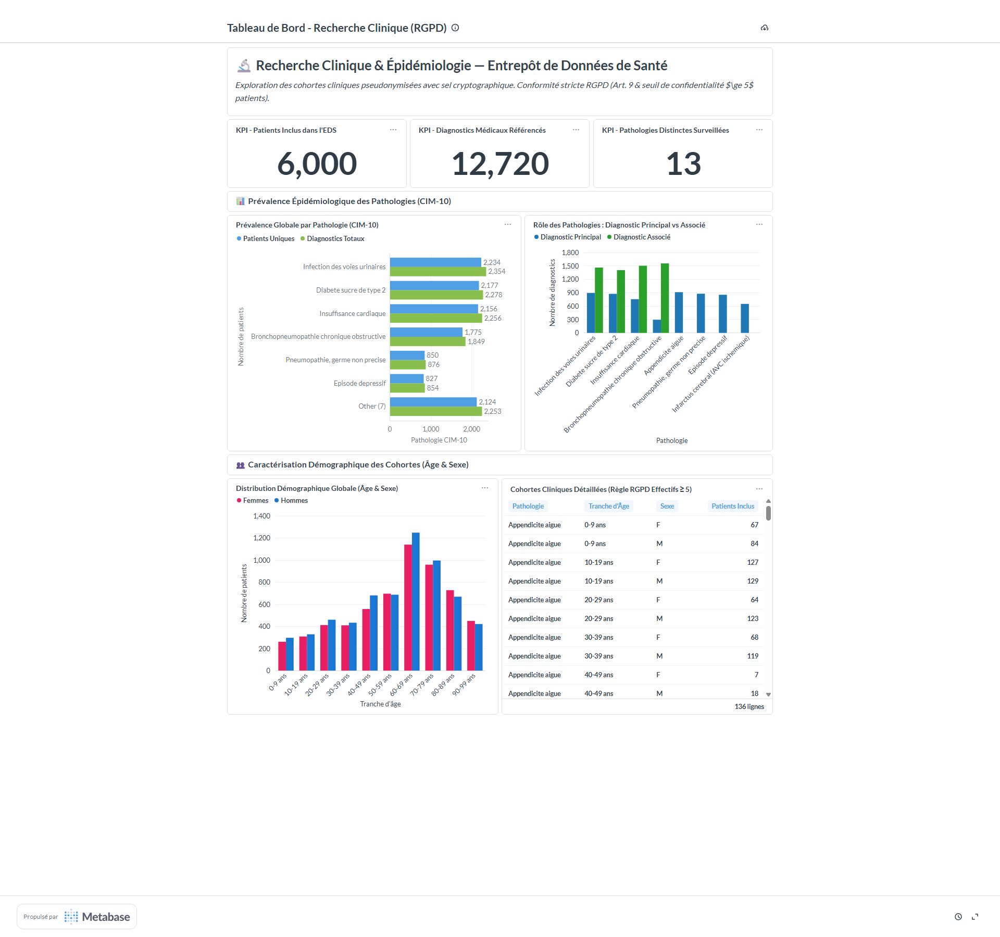

# CENTRE HOSPITALIER UNIVERSITAIRE (CHU)
## Entrepôt de Données de Santé (EDS) — Dossier d'Architecture, Modélisation & Restitution Décisionnelle

* **Projet :** Entrepôt de Données de Santé (EDS) — Fil Rouge
* **Niveau :** Master 2 — Big Data & Santé
* **Auteur :** Équipe Ingénierie des Données
* **Date :** Septembre 2026
* **Version :** 2.0 (Consolidation Finale — Lot d'Évolution 2026-08-29)

---

## Sommaire
1. [Besoin (Analyse du Besoin Métier & Usages Cibles)](#1-besoin-analyse-du-besoin-métier--usages-cibles)
2. [Sources (Inventaire & Description des Données Sources)](#2-sources-inventaire--description-des-données-sources)
3. [Schéma d'Architecture Justifié](#3-schéma-darchitecture-justifié-choix-techniques--patron-médaillon)
4. [Traitements (Chaîne de Traitement & Contrôles Qualité)](#4-traitements-chaîne-de-traitement--contrôles-qualité)
   * [4.1 Sécurité & Anonymisation dès l'entrée du Lake (RGPD)](#41-sécurité--anonymisation-dès-lentrée-du-lake-rgpd)
   * [4.2 Ingestion Incrémentale Bronze & Idempotence](#42-ingestion-incrémentale-bronze--idempotence)
   * [4.3 Nettoyage Silver & Modèle en Étoile (Star Schema)](#43-nettoyage-silver--modèle-en-étoile-star-schema)
   * [4.4 Focus Décisionnel : Pourquoi le calcul des alertes est fait en Silver et non en Gold ?](#44-focus-décisionnel--pourquoi-le-calcul-des-alertes-est-fait-en-silver-et-non-en-gold-)
   * [4.5 Résolution des Deux Pièges Métier du Sujet (NEURO et 0 jointure fact-fact)](#45-résolution-des-deux-pièges-métier-du-sujet-neuro-et-0-jointure-fact-fact)
5. [Indicateurs (Indicateurs Métier Clés & Datamarts Gold)](#5-indicateurs-indicateurs-métier-clés--datamarts-gold)
6. [Visualisations (Dashboards Metabase & Cloisonnement des Droits)](#6-visualisations-dashboards-metabase--cloisonnement-des-droits)
   * [6.1 Cockpit Pilotage Hospitalier (Direction)](#61-cockpit-pilotage-hospitalier-direction)
   * [6.2 Cockpit Recherche Clinique & Épidémiologie (Chercheurs, Seuil RGPD $\ge 5$)](#62-cockpit-recherche-clinique--épidémiologie-chercheurs-seuil-rgpd-ge-5)
   * [6.3 Cockpit Facturation T2A & Plateau Technique (DIM — Évolution)](#63-cockpit-facturation-t2a--plateau-technique-dim--évolution)
7. [Limites & Recommandations](#7-limites--recommandations-limites-du-système--recommandations-stratégiques)
   * [7.1 Limites Techniques & de Modélisation](#71-limites-techniques--de-modélisation)
   * [7.2 Recommandations Opérationnelles & Médico-Économiques](#72-recommandations-opérationnelles--médico-économiques)

---

## 1. Besoin (Analyse du Besoin Métier & Usages Cibles)

### 📌 Contexte Hospitalier & Problématique :
Au Centre Hospitalier Universitaire (CHU), les données de santé sont historiquement fragmentées dans des bases de données hétérogènes (Dossier Patient Informatisé, logiciel de gestion des Urgences, serveurs du Laboratoire, monitorings au chevet du patient) et exportées chaque jour sous des formats disparates.

La Direction du CHU a exprimé le **besoin impératif d'unifier ces données au sein d'un Entrepôt de Données de Santé (EDS)** pour répondre à 3 cas d'usage métiers majeurs, strictement cloisonnés :

1. **Besoin 1 — Pilotage Hospitalier (Direction Générale & Chefs de Pôle) :**
   * *Objectif :* Avoir un cockpit de pilotage décisionnel pour fluidifier le parcours patient.
   * *Besoins fonctionnels :* Suivre en continu la tension des Urgences (flux journalier, taux d'hospitalisation), mesurer l'efficience des services via la Durée Moyenne de Séjour (DMS), contrôler la sécurité des soins via les réadmissions précoces à 30 jours et surveiller les constantes vitales en temps réel (alertes physiologiques).

2. **Besoin 2 — Recherche Clinique & Épidémiologie (Praticiens & Épidémiologistes) :**
   * *Objectif :* Faciliter les études observationnelles et la constitution de cohortes sans risque de ré-identification.
   * *Besoins fonctionnels :* Évaluer la prévalence des pathologies (codes CIM-10), caractériser les populations par tranche d'âge et sexe, tout en respectant strictement la réglementation RGPD (Art. 9 sur les données sensibles et règle du secret statistique $\ge 5$ patients par cellule).

3. **Besoin 3 — Valorisation Médico-Économique T2A (DIM — Département d'Information Médicale) :**
   * *Objectif :* Optimiser les recettes de l'établissement et piloter la charge des plateaux techniques.
   * *Besoins fonctionnels :* Réconcilier les actes médicaux cotés (nomenclature CCAM) avec les séjours, calculer la valorisation financière T2A (2,2 M€), analyser l'intensité et la saturation des lits par service.

---

## 2. Sources (Inventaire & Description des Données Sources)

L'établissement dépose chaque jour ses fichiers bruts dans un espace partagé `source-filestorage/`, accessible en lecture seule. Les formats sont volontairement hétérogènes pour refléter la réalité du système d'information hospitalier :

| Flux Source | Format Source | Volumétrie / Fréquence | Description & Particularités Métier |
| :--- | :---: | :---: | :--- |
| **`patients/`** | CSV | Quotidien (18 000 lignes) | Identité des patients. **Contient des données directement identifiantes sensibles** (`nir`, `nom`, `prenom`, date de naissance complète) qui ne doivent en aucun cas pénétrer dans l'entrepôt. |
| **`sejours/`** | CSV | Quotidien (6 797 séjours) | Passages hospitaliers (dates entrée/sortie, modes d'admission et de sortie). Comprend des séjours clôturés et des séjours en cours (`discharge_ts` vide légitime). |
| **`diagnostics/`** | JSON | Quotidien (12 720 codes) | Structure JSON imbriquée : un séjour associe plusieurs codes CIM-10 typés en diagnostic principal ou associé. |
| **`monitoring/`** | Parquet | Quotidien (41 778 relevés) | **Flux volumineux à haute fréquence** de constantes vitales au chevet (Fréquence cardiaque, Saturation en oxygène $SpO_2$, Température). |
| **`referentiels/`** | CSV | Statique (dépôt initial) | Tables de nomenclature : `services.csv` (libellés des services) et `cim10.csv` (libellés des pathologies). |
| **`description_service.csv`** *(Évolution)* | CSV | Dépôt 2026-08-29 (7 lignes) | Enrichissement hiérarchique des services : `categorie`, `capacite_lits`, `pole`. *(Comporte une omission : le service de Neurologie n'y est pas décrit).* |
| **`ccam.csv`** *(Évolution)* | CSV | Dépôt 2026-08-29 (8 lignes) | Référentiel de nomenclature CCAM des actes techniques et tarifs réglementaires de facturation T2A en euros. |
| **`actes/`** *(Évolution)* | Parquet | Dépôt 2026-08-29 (8 112 actes) | Flux de faits des actes techniques réalisés (`stay_id`, `code_ccam`, `acte_ts`). Le service réalisateur n'y est pas directement mentionné. |

---

## 3. Schéma d'Architecture Justifié (Choix Techniques & Patron Médaillon)

Le système implémente l'architecture de référence « patron médaillon » (Lake $\to$ Bronze $\to$ Silver $\to$ Gold $\to$ Restitution) :



### Justification des choix technologiques :

1. **Entrepôt ClickHouse en local (Docker) :**
   * Moteur colonnaire analytique (OLAP) de référence, offrant des performances de compression et d'agrégation vectorisée exceptionnelles sur de grands volumes (particulièrement le flux haute fréquence de constantes et les actes).
   * Déploiement ultra-léger et autonome sur poste local via conteneur Docker.
2. **Principe du « 100% SQL dans le moteur » (ELT) :**
   * *Respect strict de la consigne anti-pattern :* Aucune donnée n'est extraite en mémoire applicative (Pandas) pour subir des transformations. Sortir des millions de lignes d'un moteur colonnaire pour les manipuler en mémoire applicative ne passe pas à l'échelle en environnement Big Data.
   * ClickHouse exécute l'intégralité des jointures, déduplications et calculs analytiques en SQL natif à pleine puissance processeur.
3. **Orchestration légère en Python :**
   * Rôle strictement cantonné à l'orchestration : copie sécurisée des fichiers bruts, anonymisation à l'entrée du Lake, contrôle de séquence et envoi des ordres SQL à ClickHouse avec journalisation d'audit dans `admin.pipeline_runs`.
4. **Restitution Metabase (Docker) :**
   * Solution décisionnelle moderne permettant de concevoir des tableaux de bord interactifs sans code pour les équipes médicales et administratives.
   * Gestion granulaire des droits d'accès permettant un cloisonnement étanche des collections selon les profils métiers.

---

## 4. Traitements (Chaîne de Traitement & Contrôles Qualité)

### 4.1 Sécurité & Anonymisation dès l'entrée du Lake (RGPD)
Conformément aux exigences de l'Article 9 du RGPD et à la valorisation bonus du projet :
* **Hachage salé irréversible :** À l'entrée du Lake, l'identifiant patient en clair (`patient_id`) est transformé par un condensat cryptographique déterministe salé (`HMAC-SHA256`). Ce pseudonyme stable préserve les jointures futures avec les séjours tout en empêchant toute ré-identification inverse.
* **Purge des identifiants directs :** Les colonnes d'identité réelle (`nom`, `prenom`, `nir`) sont définitivement détruites avant toute entrée dans l'entrepôt.
* **Généralisation temporelle :** La date de naissance complète est tronquée en année de naissance (`birth_year`) pour supprimer la précision journalière identifiante.

---

### 4.2 Ingestion Incrémentale Bronze & Idempotence



* **Détection automatique des dépôts :** Le script d'ingestion inspecte quotidiennement les répertoires horodatés (`AAAA-MM-JJ`).
* **Traçabilité & Idempotence :** Tout lot déjà journalisé dans `admin.pipeline_runs` avec le statut `SUCCESS` est automatiquement ignoré (`[SKIP]`), garantissant qu'aucune ré-exécution n'engendre de doublons.
* **Typage strict :** Les données sont stockées sous le moteur colonnaire `MergeTree` partitionné par date source (`source_date`).

---

### 4.3 Nettoyage Silver & Modèle en Étoile (Star Schema)



La couche Silver restructure les données brutes sous un modèle dimensionnel en étoile rigoureux (**4 dimensions** et **4 tables de faits**) en appliquant les règles de cohérence médicale :

1. **Déduplication des Patients (`silver.dim_patients`) :**  
   Utilisation du moteur ClickHouse `ReplacingMergeTree(source_date)` sur `patient_pseudo_id`. Les 18 000 lignes brutes sont consolidées en **6 000 patients uniques**, en conservant automatiquement la version la plus récente.
2. **Cohérence Temporelle des Séjours (`silver.fact_sejours`) :**  
   Filtrage strict en SQL : les 68 séjours aberrants présentant une sortie antérieure à l'admission (`discharge_ts < admission_ts`) sont écartés. Les 683 séjours en cours (`discharge_ts IS NULL`) sont légitimement conservés. Durée de séjour calculée en jours (`duree_sejour_jours`).
3. **Contrôle Qualité Physiologique (`silver.fact_monitoring`) :**  
   Sur 41 778 mesures brutes, **858 anomalies hors bornes physiologiques humaines** sont éliminées (Fréquence cardiaque hors [20–250 bpm], Saturation $SpO_2$ hors [50–100 %], Température hors [30–45 °C]), retenant **40 920 mesures physiologiquement valides**.

---

### 4.4 Focus Décisionnel : Pourquoi le calcul des alertes est fait en Silver et non en Gold ?

Une décision de conception déterminante réside dans le pré-calcul des indicateurs d'alerte vitale (`is_alert`, `alert_type`) au niveau de la table de faits `silver.fact_monitoring` plutôt qu'à la volée dans les vues SQL de la couche `gold`.

```text
┌─────────────────────────────────────────────────────────────────────────────┐
│ ANTI-PATTERN ÉVITÉ (Calcul dynamique dans Gold) :                           │
│ Chaque requête / Dashboard / Cron ──> Scan de 40 920 lignes                 │
│                                   ──> Réévaluation de 3 CASE WHEN lourds   │
│                                   ──> Consommation CPU & latence d'affichage│
└─────────────────────────────────────────────────────────────────────────────┘

┌─────────────────────────────────────────────────────────────────────────────┐
│ BONNE PRATIQUE RETENUE (Matérialisation en Silver) :                        │
│ 1. Coût Unique à l'ingestion : Règles évaluées une seule fois lors de l'ELT.│
│ 2. Compression Colonnaire : 'is_alert' stocké sur 1 octet (UInt8) ultra-    │
│    compressé par ClickHouse.                                                │
│ 3. Vues Gold Vectorisées : Simple `countIf(is_alert = 1)` exécuté en        │
│    quelques millisecondes sans aucune charge CPU superflue.                 │
└─────────────────────────────────────────────────────────────────────────────┘
```

**Les 3 arguments clés :**
1. **Économie de calcul pour les exécutions planifiées (Crons) :** Les données de surveillance médicale représentent la volumétrie la plus massive de l'hôpital. En calculant les alertes au moment de l'ingestion journalière, le coût computationnel n'est payé qu'une seule fois. Les jobs de cron et les rafraîchissements réguliers ne gaspillent pas de cycles CPU à re-vérifier des seuils statiques.
2. **Réactivité instantanée des tableaux de bord Metabase :** L'utilisateur final (chef de service, médecin régulateur) bénéficie d'un temps de réponse sous la seconde, la vue se contentant de filtrer sur une colonne indexée.
3. **Auditabilité et reproductibilité médicale :** L'alerte devient une métrique immuable historisée dans la table de faits, éliminant tout risque de divergence ou d'incohérence si les règles métiers venaient à être modifiées ultérieurement.

---

### 4.5 Résolution des Deux Pièges Métier du Sujet

1. **Piège 1 : Le référentiel de description incomplet (`NEURO` absent) :**  
   * *Problème :* Le fichier `description_service.csv` ne décrit que 7 services sur les 8 présents dans l'entrepôt (le service `NEURO` est omis).
   * *Solution :* Réalisation d'une jointure `LEFT JOIN` avec valeurs de repli par défaut : catégorie = *« Non catégorisé »*, pôle = *« Pôle Indéterminé »*, capacité = *0 lit*.
   * *Résultat :* **Zéro ligne rejetée**, intégrité référentielle préservée et anomalie immédiatement visible par les gestionnaires dans les tableaux de bord.
2. **Piège 2 : « Actes par service » porté par le séjour sans jointure fact-to-fact :**  
   * *Problème :* Le fichier `actes.parquet` associe un acte à un séjour (`stay_id`), sans préciser le service. Joindre deux tables de faits colossales (`fact_acte` et `fact_sejours`) dans les vues Gold est un anti-pattern rédhibitoire du Big Data.
   * *Solution :* **Dénormalisation contrôlée** du champ `service_code` directement lors du chargement dans `silver.fact_acte` par lookup sur le séjour.
   * *Résultat :* Les datamarts Gold interrogent une simple étoile `fact_acte ⋈ dim_services`, offrant une exécution sub-seconde sans saturation mémoire.

---

## 5. Indicateurs (Indicateurs Métier Clés & Datamarts Gold)



Toutes les vues Gold sont sécurisées via `DEFINER = default SQL SECURITY DEFINER` pour autoriser la consultation par l'utilisateur technique Metabase sans lui ouvrir l'accès aux couches sous-jacentes :

### 📊 Synthèse des Métriques Consolidées en Base (Août 2026) :

| Domaine Métier | Datamart Gold | Indicateur Clé | Valeur Calculée | Interprétation Décisionnelle |
| :--- | :--- | :--- | :---: | :--- |
| **Pilotage** | `gold.vue_pilotage_dms` | DMS Globale CHU | **5.15 jours** | Durée moyenne de séjour conforme aux standards. |
| **Urgences** | `gold.vue_pilotage_urgences` | Passages Urgences | **1 423 passages** | ~50 passages / jour (pic à 82 le 21/08). |
| **Urgences** | `gold.vue_pilotage_urgences` | Taux d'Hospitalisation | **31.75 %** | 418 patients admis en lits d'aval (tension modérée). |
| **Qualité** | `gold.vue_pilotage_readmissions_30j` | Taux Réadmission 30j | **10.54 %** | 637 réadmissions précoces sur 6 046 sorties. |
| **Vigilance** | `gold.vue_pilotage_alertes` | Taux Global d'Alertes | **7.46 %** | 3 052 alertes (36.9% hypoxies, 35.5% thermiques). |
| **Recherche** | `gold.vue_recherche_synthese` | Patients Cohorte | **6 000 patients** | Base pseudonymisée stable et dédoublonnée. |
| **Recherche** | `gold.vue_recherche_prevalence` | Top Pathologies CIM-10 | **N39, E11, I50** | Comorbidités chroniques majeures (> 30% des patients). |
| **Recherche** | `gold.vue_recherche_cohortes` | Pyramide des Âges | **51 % > 60 ans** | Pic sur les 60-69 ans (2 388 patients). Seuil $\ge 5$ respecté. |
| **T2A (Évol.)** | `gold.vue_pilotage_facturation_t2a` | Recettes Totales T2A | **2 199 450 €** | 8 112 actes facturés. Cardio en tête (521 k€). |
| **CCAM (Évol.)** | `gold.vue_pilotage_actes_ccam` | Top Volume CCAM | **Radiographie thorax** | 1 043 actes (26 075 € valorisés). |
| **CCAM (Évol.)** | `gold.vue_pilotage_actes_ccam` | Top Valeur CCAM | **Appendicectomie** | 978 actes @ 800 € (**782 400 €**, soit 35.6% du total). |
| **Plateau** | `gold.vue_pilotage_densite_plateau` | Densité Moyenne Lit | **38.64 actes / lit** | Urgences (86.5) et Cardio (64.5) sous forte tension. |
| **Parcours** | `gold.vue_pilotage_actes_services` | Moyenne Acte / Séjour | **1.59 acte / séjour** | Homogénéité remarquable des pratiques médicales. |

---

## 6. Visualisations (Dashboards Metabase & Cloisonnement des Droits)

La sécurité d'accès repose sur deux niveaux étanches :
1. **Niveau ClickHouse :** Compte technique `metabase_user` disposant strictement du droit `SELECT ON gold.*` (`ACCESS_DENIED` sur `silver.*` et `bronze.*`).
2. **Niveau Metabase :** Cloisonnement 100% exclusif des groupes et collections d'analyses.

---

### 6.1 Cockpit Pilotage Hospitalier (Direction)
* **Compte dédié :** `directeur@eds-chu.fr` / `DirecteurPassword123!`
* **Périmètre accessible :** Collection exclusive `🏥 Pilotage Hospitalier`



*Scorecards grand format (Urgences: 1 423, DMS: 5.2j, Réadmissions: 10.5%, Alertes: 7.5%), graphique horizontal des DMS par service, tableau synthétique d'activité, courbes des flux d'urgences et barres empilées de surveillance des alertes physiologiques.*

---

### 6.2 Cockpit Recherche Clinique & Épidémiologie (Chercheurs, Seuil RGPD $\ge 5$)
* **Compte dédié :** `chercheur@eds-chu.fr` / `ChercheurPassword123!`
* **Périmètre accessible :** Collection exclusive `🔬 Recherche Clinique`



*Cartes de synthèse de cohorte (6 000 patients, 12 720 diagnostics, 13 pathologies), barres horizontales de prévalence CIM-10, ventilation Diagnostic Principal vs Associé, pyramide des âges groupée Hommes/Femmes et tableau détaillé conforme à la règle des effectifs $\ge 5$.*

---

### 6.3 Cockpit Facturation T2A & Plateau Technique (DIM — Évolution)
* **Compte dédié :** `dim@eds-chu.fr` / `DimPassword123!`
* **Périmètre accessible :** Collection exclusive `💰 Facturation T2A & Plateau Technique`


*KPIs financiers (Total Actes: 8 112, Montant T2A: 2 199 450 €, Densité: 38.6 actes/lit), palmarès CCAM, recettes par service et pôle, tableau d'activité par catégorie et graphique de saturation des lits.*

---

## 7. Limites & Recommandations (Limites du Système & Recommandations Stratégiques)

### 7.1 Limites Techniques & de Modélisation

1. **Absence de comptabilité analytique des coûts réels :**  
   Les indicateurs T2A actuels reflètent les **recettes théoriques brutes** issues des tarifs réglementaires. L'entrepôt n'intègre pas les charges réelles d'exploitation (coûts salariaux des soignants, amortissement des équipements lourds, consommables opératoires), ce qui empêche le calcul d'une marge nette réelle par séjour.
2. **Latence de traitement par lots (Batch quotidien) :**  
   La chaîne tourne en batch nocturne quotidien. Bien que parfaitement adaptée à la facturation T2A et au pilotage stratégique, cette périodicité est inopérante pour la surveillance d'urgence des constantes vitales, qui requerrait une ingestion en streaming temps réel (ex: Apache Kafka) pour alerter les soignants au chevet en quelques secondes.
3. **Capacitaire théorique vs Lits opérationnels :**  
   Le référentiel de lits est statique. Il ne prend pas en compte les fermetures temporaires de lits (absentéisme soignant, travaux de désinfection), sous-estimant ponctuellement les taux réels de saturation du plateau technique.

---

### 7.2 Recommandations Opérationnelles & Médico-Économiques

1. **Régulation de l'Aval des Urgences :**  
   Avec **31.75 % d'hospitalisations post-urgences**, instaurer une politique institutionnelle de libération anticipée des lits de médecine (Cardiologie, Pneumologie) dès 11h du matin pour absorber le pic d'admissions des urgences constaté entre 14h et 18h.
2. **Protocole de Suivi Post-Séjour (Qualité des soins) :**  
   Déployer une consultation téléphonique de suivi à J+7 ciblée en priorité sur les patients âgés insuffisants cardiaques (`I50`) et BPCO (`J44`), principaux contributeurs aux **10.54 % de réadmissions à 30 jours**.
3. **Extension du Plateau de Coronarographie :**  
   Le service de Cardiologie présente une densité record de **64.50 actes / lit** et génère **521 k€**. L'ouverture de 5 lits supplémentaires d'hospitalisation de semaine permettrait d'augmenter le volume d'actes programmés sans engorger les lits de soins intensifs d'urgence.
4. **Gouvernance des Référentiels SIH :**  
   Demander formellement à la Direction des Services Numériques d'actualiser le référentiel `description_service.csv` pour officialiser la capacité en lits et le rattachement de pôle du service de **Neurologie**, afin de supprimer définitivement le statut de repli par défaut *« Non catégorisé »*.
